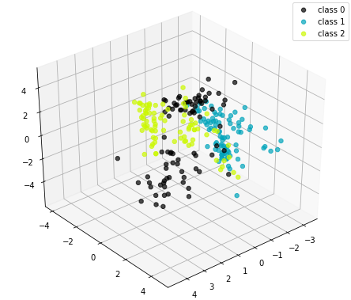
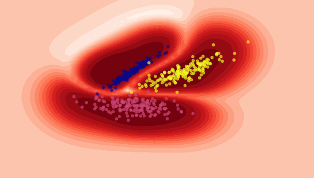
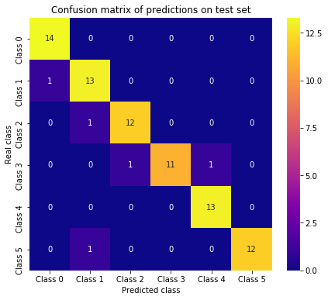
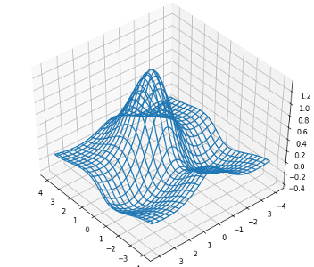
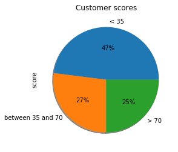
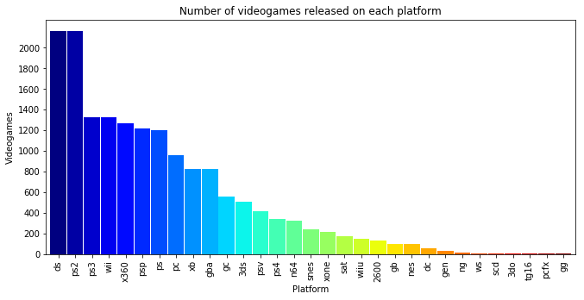

This repository contains graph plotting examples using the libraries numpy, pandas and matplotlib focused on data visualization for machine & deep learning

* [Function series plotting](series.ipynb)  

* [Scatter graphics (2d & 3d). Helps you to visualize patterns in your data and analyze separability on classification problems](scatter.ipynb)  

* [Plot classification boundaries using contours](contours.ipynb)  

* [Heatmap to show confusion matrices](heatmap.ipynb)  

* [Plot 3D surfaces](surfaces.ipynb)  

* [Pie](pie.ipynb) & [bar](bars.ipynb) graphics to get data insights  

